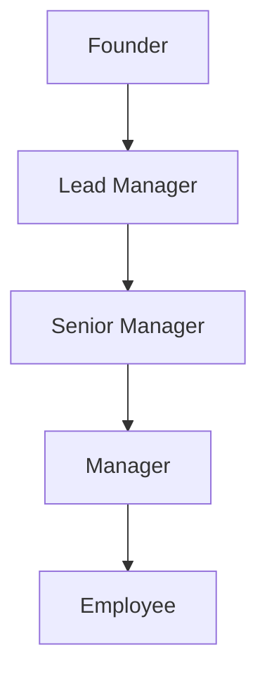

# New Companies

- [New Companies](#new-companies)
  - [Description of the problem](#description-of-the-problem)
    - [Input Format](#input-format)
    - [Sample Input](#sample-input)
    - [Sample output](#sample-output)
    - [Explanation](#explanation)
  - [Solutions](#solutions)
    - [MySQL](#mysql)
      - [Process](#process)
      - [Answer](#answer)

---

## Description of the problem
Amber's conglomerate corporation just acquired some new companies. Each of the companies follows this hierarchy: 


Given the table schemas below, write a query to print the company_code, founder name, total number of lead managers, total number of senior managers, total number of managers, and total number of employees. Order your output by ascending company_code.

Note:

- The tables may contain duplicate records.
- The company_code is string, so the sorting should not be numeric. For example, if the company_codes are C_1, C_2, and C_10, then the ascending company_codes will be C_1, C_10, and C_2.

### Input Format

The following tables contain company data:

- **Company**: The `company_code` is the code of the company and `founder` is the founder of the company.

**Column** | **Type**
--- | ---
`company_code` | String
`founder` | String

- **Lead_Manager**: The `lead_manager_code` is the code of the lead manager, and the `company_code` is the code of the working company

**Column** | **Type**
--- | ---
`lead_manager_code` | String 
`company_name` | String

- **Senior_Manager**: The `senior_manager_code` is the code of the senior manager, the `lead_manager_code` is the code of its lead manager, and the `company_code` is the code of the working company.

**Column** | **Type**
--- | ---
`senior_manager_code` | String
`lead_manager_code` | String
`company_code` | String

- **Manager**: The `manager_code` is the code of the manager, the `senior_manager_code` is the code of its senior manager, the `lead_manager_code` is the code of its lead manager, and the `company_code` is the code of the working company

**Column** | **Type**
--- | ---
`manager_code` | String
`senior_manager_code` | String
`lead_manager_code` | String
`company_code` | String

- **Employee**: The `employee_code` is the code of the employee, the `manager_code` is the code of its manager, the `senior_manager_code` is the code of its senior manager, the `lead_manager_code` is the code of its lead manager, and the `company_code` is the code of the working company.

**Column** | **Type**
--- | ---
`employee_code` | String
`manager_code` | String
`senior_manager_code` | String
`lead_manager_code` | String
`company_code` | String

### Sample Input
- Company table: 

`company_code` | `founder`
--- | ---
C1 | Monika 
C2 | Samantha

- Lead_manager table:

`lead_manager_code` | `company_code`
--- | --- 
LM1 | C1
LM2 | C2

- Senior_manager table: 

`senior_manager_code` | `lead_manager_code` | `company_code`
--- | --- | ---
SM1 | LM1 | C1
SM2 | LM1 | C1 
SM3 | LM2 | C2

- Manager table

`manager_code` | `senior_manager_code` | `lead_manager_code` | `company_code`
--- | --- | --- | ---
M1 | SM1 | LM1 | C1
M2 | SM3 | LM2 | C2
M3 | SM3 | LM2 | C2

- Employee table:

`employee_code` |  `manager_code` | `senior_manager_code` | `lead_manager_code` | `company_code`
--- | --- | --- | --- | --- 
E1 | M1 | SM1 | LM1 | C1
E2 | M1 | SM1 | LM1 | C1 
E3 | M2 | SM3 | LM2 | C2 
E4 | M3 | SM3 | LM2 | C2

### Sample output 
```
C1 Monika 1 2 1 2
C2 Samantha 1 1 2 2
```

### Explanation

In company C1, the only lead manager is LM1. There are two senior managers, SM1 and SM2, under LM1. There is one manager, M1, under senior manager SM1. There are two employees, E1 and E2, under manager M1.

In company C2, the only lead manager is LM2. There is one senior manager, SM3, under LM2. There are two managers, M2 and M3, under senior manager SM3. There is one employee, E3, under manager M2, and another employee, E4, under manager, M3.


---

## Solutions


### MySQL

#### Process

#### Answer

```sql
SELECT C.company_code, C.founder, COUNT(DISTINCT L.lead_manager_code) AS total_number_lead, COUNT(DISTINCT S.senior_manager_code) AS total_number_senior, COUNT(DISTINCT M.manager_code) AS total_number_manager, COUNT(DISTINCT E.employee_code)
FROM Company C
LEFT JOIN Lead_Manager L ON C.company_code = L.company_code
LEFT JOIN Senior_Manager S ON C.company_code = S.company_code
LEFT JOIN Manager M ON C.company_code = M.company_code
LEFT JOIN Employee E ON C.company_code = E.company_code
GROUP BY C.company_code, C.founder
ORDER BY C.company_code;
```
